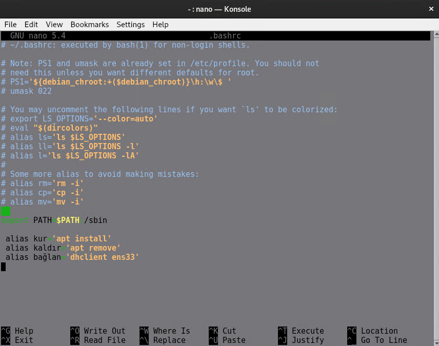

# **Shell Interpreter’ları ve Yönetimi**

## **Shell Interpreter Kavramı**
Linux ve türevi olan işletim sistemlerinin shell’ini kullanmayı sağlayan aracılar vardır.
Bu aracılar birer yorumlayıcıdır (interpreter’dır) ve CLI ortamında kullanılırlar. 

Shell Interpreter, yani kabuk yorumlayıcısı, bir işletim sisteminde kullanıcı ile sistem arasındaki etkileşimi sağlayan bir programdır. Kullanıcının komutlarını alır, yorumlar ve işletim sistemi çekirdeğine (kernel) ileterek çalıştırılmasını sağlar.  [1](#kaynakça)

Linux’ta varsayılan shell interpreter’ı, Bash (Bourne Again Shell)’tir.

Alternatifleri ve yaygın kullanılanlar arasında Zsh, Dash, Fish, Ksh, Csh vb. bulunur.

Kullanılan mevcutshell interpreter’ı `echo $SHELL` veya `echo $0` komutlarıylagörüntülenebilir.


Kullanılabilir diğer shell interpreter’ları `/etc/shells` dosyasında yazılıdır.


Shell'ler arasında anlık geçiş, sadece shell adı belirtilerek sağlanabilir. 


Shell’ler kurulabilirdir ve bir kullanıcı için varsayılan shell, chsh komutuyla değiştirilebilir.
`chsh -s /bin/dash master` bu komut kullanıldıkdan sonra kullanıcı çıkış yapıp tekrar girdiğinde kullanıdığı yorumlayıcı dash olarak değişir.

## **Bash Profili ve Dosyaları**

- **Bash Shell Konumu**  
  - Bash shell’inin kendisi `/bin/bash` dosyasında bulunur.  
  - Kullanıcılar için `/usr/bin/bash` konumundadır. 

- **Genel Ayar Dosyası**  
  - Bash shell’inin genel ayar dosyası **`/etc/profile`** içindedir.  
  - Sistem genelinde ayarlar buradan okunur.  

- **Kullanıcıya Özgü Ayar Dosyası**  
  - Kullanıcıya özel ayarlar **`~/.bashrc`** dosyasında bulunur.  
  - Her kullanıcı için ayrı bir `.bashrc` dosyası bulunur.   
  - Varsayılan ayarların yedeği **`/etc/skel/.bashrc`** içindedir.  
  - **Resetleme için:**  
    ```bash
    cp /etc/skel/.bashrc ~/
    ```
    bu komutla kullanıcının `.bashrc` dosyası sıfırlanır orjinal hali kopyalanmış olur.

- **Bash Onarımı**  
  - Bash shell’inde bir hata oluştuğunda, tekrar yüklemek için:  
    ```bash
    apt install --reinstall bash
    ```

- **Komut Geçmişi**  
  - Kullanıcıya özgü çalıştırılan komutların geçmişi **`~/.bash_history`** dosyasında saklanır. Bu dosya kullanıcıya özeldir.  


## **History Kullanımı**

History’de hatırlanacak olan komutlar önbellek vedosya olarak iki şekilde saklanır. `~/.bashrc` dosyasındaki
HISTSIZE değeri önbellekte, HISTFILESIZE değeri ise dosyada saklanacak olan komut satır adetlerini ifade eder.

Boşlukla başlayan ve aynı anda birden fazla kez art arda yazılan komutlar hatırlanmaz. ~/.bashrc dosyasındaki
HISTCONTROL değeri, bu davranışları kontrol eder. Varsayılan değer olan ignoreboth, her iki durumun da
göz ardı edilmesini sağlar. ignorespace veya ignoredups değerleriyle değiştirilebilir.

| **Komut**                      | **İşlev**                                                                 |
|---------------------------------|-------------------------------------------------------------------------|
| `echo $HISTSIZE`               | Önbellekte, en son girilen kaç komutun hatırlanacağını görüntüler.      |
| `echo $HISTFILESIZE`           | Dosyada, en son girilen kaç komutun hatırlanacağını görüntüler.         |
| `echo $HISTFILE`               | History dosyasının yerini görüntüler.                                   |
| `history`                      | Geçmişte kullanılan komutları listeler. (Satır adedi değeriyle sınırlıdır.) |
| `history <sayı>`               | Geçmişte en son kullanılan komutları verilen sayı kadar listeler.       |
| `! <satır numarası>`           | İlgili numaradaki komutun tekrar çalıştırılmasını sağlar.               |
| `!!`                           | Son çalıştırılan komutun tekrar çalıştırılmasını sağlar. (Yukarı ok tuşu, Enter gibi.) |
| `!<komut>:p`                   | İlgili komutun, daha önce kullanıldığı son haliyle hatırlatılmasını sağlar. (Ctrl+R gibi.) |
| `history -d <satır numarası>`  | İlgili satırda hatırlanan komutun unutulmasını (geçmişten silinmesini) sağlar. |
| `history -c`                   | Anlık oturumdaki önbelleğin tüm geçmişini siler.                        |
| `history -c && history -w`     | Oturumun silinen önbelleğini dosyaya da yazar.                          |


---

### `echo $HISTSIZE - $HISTFILESIZE - $HISTFILE`
HISTSIZE : Önbellekte, en son girilen kaç komutun hatırlanacağını görüntüler.

HISTFILESIZE : Dosyada, en son girilen kaç komutun hatırlanacağını görüntüler.

HISTFILE : History dosyasının yerini görüntüler.


---

### `history`
Geçmişte kullanılan komutları listeler. (Satır adedi değeriyle sınırlıdır.)


---

### `history <sayı>`
Geçmişte en son kullanılan komutları verilen sayı kadar listeler.


---

### `! <satır numarası>`
İlgili numaradaki komutun tekrar çalıştırılmasını sağlar.


---

### `!!`
Son çalıştırılan komutun tekrar çalıştırılmasını sağlar. (Yukarı ok tuşu, Enter gibi.)


---

### `!<komut>:p`
İlgili komutun, daha önce kullanıldığı son haliyle hatırlatılmasını sağlar. (Ctrl+R gibi.)


---

### `history -d <satır numarası>`
İlgili satırda hatırlanan komutun unutulmasını (geçmişten silinmesini) sağlar.


---

### `history -c`
Anlık oturumdaki önbelleğin tüm geçmişini siler.


---

## Ortam Değişkenleri

- **Ortam değişkenleri**, istenilen veya kullanılan bilgiye kısa yoldan erişebilmek için oluşturulan tanımlardır.
- Ortam değişkenleri **$** işaretiyle başlar ve **BÜYÜK HARFLERDEN** oluşurlar.  
  Örnekler:  
  - `$SHELL`  
  - `$XDG_CURRENT_DESKTOP`  
  - `$USER`
  
- Sistemdeki ortam değişkenleri **`printenv`** veya **`env`** komutlarıyla listelenebilirler.
  
- Değişkenlerin değerleri yazdırılabilir:  
  - `echo $DEĞİŞKENADI`  
  - `printenv DEĞİŞKENADI`  
  Örneğin:  
  - `echo $SHELL`  
  - `printenv SHELL`
  
- Yeni bir ortam değişkeni tanımlamak için:  
  ```bash
  DEĞİŞKENADI=değeri
  ```
- Ortam değişkenini silmek için 

  ```
  unset DEĞİŞKENADI
  ```
- Değişken adları, küçük harflerden oluşamazlar ve sayısal bir karakter ile başlayamazlar.

- Ortam değişkenleri ayarlanmadıkları sürece geçicidir.

- **`export`** ortam değişkenini sadece mevcut terminalde değil, yeni başlatılacak tüm süreçlerde de kullanılabilir hale getirir.


Aşağıda görüldüğü üzere isim ile değişken oluşturulduğunda değişken sadece oluşturulduğu shell de kullanılabilir.


Ama değişkeni export ile oluştutursak herhangi bir yerden kullanılabilir olur.


Değişkenlerin kalıcı olmasını istiyorsak değişkenlerin tanımlanmasını kullanıcının `.bashrc` dosyasında yaptığımızda kullanıcı shelli her kullanmak istediğinde bash dosyası yeniden yükleneceği için değişken otomatik olarak tanımlanmış olacak.

```
nano .bashrc
```
komutunu kullanıcının home dizininde çalıştırısanınz nano düzenleyicisi bashrc dosyasını açar ve dosyanın bir bölümüne tanımlamanızı yapıp kayıt ederseniz kullanıcı shelli kullanmak için her bağlandığında tanımlama yeniden çalışır .


aynı dosyayı kullanarak aliasları da kullanabilirsiniz. Aliaslar istediğiniz bir komutu istediğiniz şekilde kullanmanızı sağlar. 



Yukarıda resimde 3 adet alias root kullanıcısının bashrc dosyasında oluşturulmuştur. 

Örnek olarak `kur` aliasını incelediğimizde `apt install`komutunun kısaltılmış hali olduğunu görmekteyiz, yani root kullanıcısı terminale `kur`yazdığı zaman aslında shell bunu `apt install` algılıyor. 


## Kaynakça

[**1. Learn Linux**](https://www.learnlinux.org.za/courses/build/fundamentals/ch04s04)
